# Java Web 开发环境的搭建

本文主要介绍 Struts2 开发环境在 Windows 操作系统下的搭建，包括 Java JDK ，服务器程序 Tomcat ，开发工具 eclipse 的安装，最终达到的效果是能够在本地成功运行一个 Web 应用程序。搭建过 Web 应用程序对的读者可忽略。

## 软件清单

软件名|安装包|下载地址
:-:|:-:|:-
Java8|jdk-8.0.1\_windows-x64\_bin.exe|http://www.oracle.com/technetwork/java/javaee/overview/index.html
Eclipse4.5|eclipse-jee-mars-2-win32-x86_64.zip|https://www.eclipse.org/downloads/eclipse-packages
Tomcat8|apache-tomcat-8.0.46.zip|http://archive.apache.org/dist/tomcat

>需要注意的是，安装包的版本选择应该根据实际运行的操作系统来定。

## 安装Java

双击运行 `.exe` 的安装包，按照指示一步步直到完成即可，这一步较为简单，接下来是配置 Java 环境变量。

安装完成之后，找到安装目录，例如本人的安装目录为 `C:\Program Files\Java`，安装完成之后会生成的目录结构如下：

```puml {align="center"}
@startsalt
{
{T
 + C:\Program Files\Java
 ++ jdk1.8.0_151
 ++ jre1.8.0_151
}
}
@endsalt
```



在开始菜单或桌面右击"计算机" > 点击"属性" > 点击"更改设置" > 选中"高级" > 点击"环境变量"。

 新建系统环境变量 JAVA_HOME，填入值`C:\Program Files\Java\jdk1.8.0_151`，该值与安装目录有关。

 新建环境变量 CLASS_PATH，值设置为`.;%JAVA_HOME%\lib;%JAVA_HOME\lib\tools.jar%`

 将`C:\Program Files\Java\jre1.8.0_151\bin`与`C:\Program Files\Java\jdk1.8.0_151\bin`加到环境变量Path末尾。

完成之后，在打开CMD命令窗口，按输入命令`java -version`，若有版本提示信息表示 Java 初步安装配置成功。

```bash
C:\Users\robothy>java -version
java version "1.8.0_151"
Java(TM) SE Runtime Environment (build 1.8.0_151-b12)
Java HotSpot(TM) 64-Bit Server VM (build 25.151-b12, mixed mode)
C:\Users\robothy>
```

## 安装 eclipse

eclipse 的运行要求是已经安装了 Java，将 eclipse-jee-mars-2-win32-x86\_64.zip 在你要安装的目录解压缩，然后在解压缩后的目录打开 eclipse.exe 即可运行。有需要的话可以在桌面添加 eclipse.exe 的快捷方式。

## 配置 Tomcat

Tomcat 的运行要求也是已经安装了 Java，将 apache-tomcat-8.0.46.zip 加压缩到目录，进入解压缩后目录下的 bin 目录，双击运行startup.bat，等待 Tomcat 启动完成，然后在浏览器中输入：`http://127.0.0.1:8080`。若显示如下页面表示 Tomcat 能够在当前环境中正常运行。

